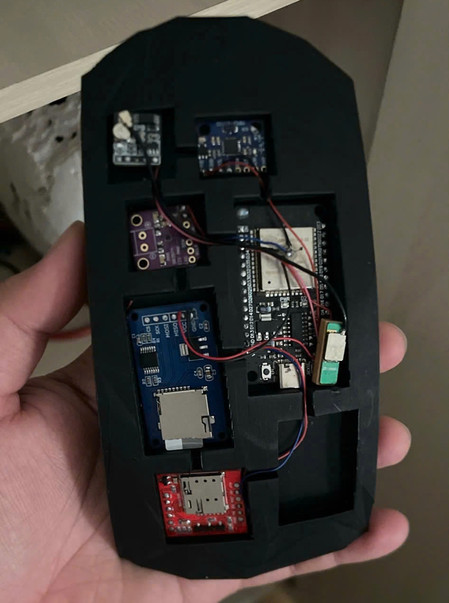
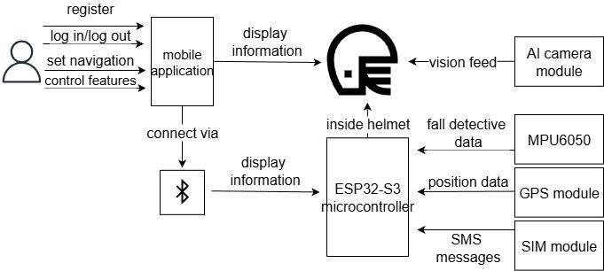

# ESP32-S3 Smart Helmet

> Hồ sơ dự án mũ bảo hiểm thông minh tích hợp HUD dẫn đường, giám sát buồn ngủ và phát hiện tai nạn kèm cảnh báo SOS.



## Research & Achievements

| Minh chứng | Vị trí | Ý nghĩa |
| --- | --- | --- |
| Paper accepted | [`paper/ACCEPTED_PAPER_SPRINGER_V2.docx`](paper/ACCEPTED_PAPER_SPRINGER_V2.docx) | Bản paper được đặt riêng để người đọc nhận biết nghiên cứu đã có đầu ra học thuật. |
| Top cuộc thi | [`awards/README.md`](awards/README.md) | Khu vực làm nổi bật thành tích/giấy chứng nhận/hình ảnh minh chứng cuộc thi của dự án. |
| Báo cáo nghiên cứu | [`reports/RESEARCH_REPORT_SMART_HELMET.docx`](reports/RESEARCH_REPORT_SMART_HELMET.docx) | Báo cáo tổng kết đề tài khoa học và công nghệ, dùng làm nguồn nội dung chính. |

## Tổng Quan

**ESP32-S3 Smart Helmet** là nguyên mẫu mũ bảo hiểm thông minh dành cho người đi mô tô, xe máy. Dự án hướng đến bài toán an toàn giao thông tại Việt Nam, nơi người lái xe hai bánh dễ gặp rủi ro do va chạm, mất tập trung khi xem bản đồ hoặc buồn ngủ trong quá trình di chuyển.

Hệ thống kết hợp phần cứng nhúng, cảm biến quán tính, camera AI, ứng dụng di động và màn hình HUD để tạo thành một bộ hỗ trợ an toàn chủ động. Mục tiêu không chỉ là phát hiện sự cố sau khi tai nạn xảy ra, mà còn cảnh báo sớm những dấu hiệu nguy hiểm trước khi tình huống trở nên nghiêm trọng.

## Điểm Nổi Bật

| Nhóm chức năng | Mô tả |
| --- | --- |
| HUD dẫn đường | Hiển thị chỉ dẫn rẽ, tốc độ và cảnh báo ngay trong tầm nhìn của người lái, giúp giảm nhu cầu cúi xuống điện thoại. |
| Giám sát buồn ngủ | Camera MaixCam phân loại trạng thái mắt mở/nhắm, kết hợp MPU-6050 để nhận diện hành vi gật đầu. |
| Phát hiện tai nạn | MPU-6050 theo dõi gia tốc và góc nghiêng, xác thực va chạm qua nhiều tầng để giảm báo động giả. |
| SOS tự động | Khi nghi ngờ tai nạn và không có phản hồi trong 10-20 giây, ứng dụng gửi SMS chứa vị trí GPS/Google Maps cho liên hệ khẩn cấp. |
| Cảnh báo đa giác quan | Rung, âm thanh, biểu tượng HUD và thông báo điện thoại giúp người lái nhận biết nguy cơ kịp thời. |

## Kiến Trúc Hệ Thống



Hệ thống được tổ chức theo mô hình IoT gồm ba khối chính:

1. **Khối phần cứng trên mũ**: ESP32-S3 điều phối cảm biến, HUD, BLE và các tín hiệu cảnh báo.
2. **Ứng dụng di động**: xử lý lộ trình, giao tiếp BLE, hiển thị cảnh báo và gửi SMS SOS.
3. **Hạ tầng định vị/liên lạc**: GPS, Google Maps và mạng di động phục vụ dẫn đường và cứu hộ.

## Thành Phần Chính

| Thành phần | Vai trò |
| --- | --- |
| ESP32-S3 | Vi điều khiển trung tâm, hỗ trợ xử lý song song và FreeRTOS. |
| MPU-6050 | Cảm biến IMU 6 trục dùng cho phát hiện va chạm, ngã xe và gật đầu. |
| MaixCam | Module camera AI giám sát trạng thái mắt theo thời gian thực. |
| OLED + combiner HUD | Hiển thị ảnh ảo trong tầm nhìn người lái. |
| BLE | Kết nối mũ với ứng dụng di động tiết kiệm năng lượng. |
| GPS/SMS qua điện thoại | Lấy vị trí và gửi cảnh báo khẩn cấp. |
| Pin Lithium 3000mAh | Cấp nguồn cho nguyên mẫu, thời lượng thử nghiệm khoảng 7-9 giờ. |

## Kết Quả Thử Nghiệm

| Hạng mục | Kết quả ghi nhận |
| --- | --- |
| Phát hiện va chạm mô phỏng | 10/10 lần thử nghiệm nghiêm trọng được phát hiện. |
| Thời gian gửi SOS | Khoảng 15 giây, bao gồm cửa sổ chờ xác thực. |
| Cảnh báo buồn ngủ | 5/5 kịch bản nhắm mắt trên 3 giây được nhận diện. |
| Độ trễ cảnh báo buồn ngủ | Khoảng 2.5-3 giây. |
| Báo động giả buồn ngủ | Khoảng 10% khi người lái nhìn xuống quá lâu. |
| Kết nối BLE | Ổn định trong phạm vi thử nghiệm khoảng 15 m. |

## Cấu Trúc Repository

```text
.
├── README.md                         # Tài liệu tổng quan dự án
├── assets/
│   └── images/                       # Hình ảnh trích xuất từ báo cáo
├── awards/
│   └── README.md                     # Minh chứng thành tích/top cuộc thi
├── paper/
│   ├── ACCEPTED_PAPER_SPRINGER_V2.docx
│   └── README.md                     # Ghi chú paper accepted
├── reports/
│   ├── RESEARCH_REPORT_SMART_HELMET.docx
│   └── README.md                     # Báo cáo nghiên cứu gốc
├── docs/
│   ├── PROJECT_OVERVIEW.md           # Bối cảnh, mục tiêu, phạm vi và nhóm thực hiện
│   ├── ARCHITECTURE.md               # Kiến trúc phần cứng, phần mềm và luồng dữ liệu
│   ├── IMPLEMENTATION.md             # Thuật toán, quy trình vận hành và thử nghiệm
│   └── RECOVERY_NOTE.md              # Ghi chú về tình trạng các file Word gốc
└── archive/
    ├── Springer-v2-recover.docx      # Bản phục hồi paper, giữ để đối chiếu
    ├── Springer-v2-repaired.zip      # Gói phục hồi đi kèm
    └── README.md
```

## Hướng Dẫn Đọc Nhanh

- Xem [`paper/`](paper/) trước nếu cần bằng chứng paper accepted.
- Xem [`awards/`](awards/) để nắm phần minh chứng top cuộc thi và nơi bổ sung chứng nhận/hình ảnh.
- Bắt đầu với [Project Overview](docs/PROJECT_OVERVIEW.md) để hiểu mục tiêu, bối cảnh và giá trị của đề tài.
- Đọc [Architecture](docs/ARCHITECTURE.md) để nắm cách các module phần cứng, phần mềm và ứng dụng di động phối hợp.
- Xem [Implementation](docs/IMPLEMENTATION.md) nếu cần chi tiết về thuật toán phát hiện va chạm, buồn ngủ, SOS và HUD.
- Xem [Recovery Note](docs/RECOVERY_NOTE.md) để biết nguồn dữ liệu và tình trạng các file `.docx`.

## Nhóm Thực Hiện

| Vai trò | Họ tên |
| --- | --- |
| Thành viên | Hà Thanh Sang |
| Thành viên | Nguyễn Việt Chân |
| Thành viên | Đỗ Minh Phúc |
| Thành viên | Nguyễn Thạch Thành |
| Thành viên | Nguyễn Minh Quang |
| Giảng viên hướng dẫn | TS. Phạm Công Thiện |

## Định Hướng Phát Triển

- Bổ sung cảm biến nhận diện người đội mũ để giảm báo động giả khi mũ bị rơi.
- Nâng cấp camera hồng ngoại và thuật toán AI để hoạt động tốt hơn trong môi trường thiếu sáng/ngược sáng.
- Tối ưu PCB, vỏ bảo vệ và bố trí linh kiện để tiến gần hơn tới thiết kế công nghiệp.
- Tích hợp 4G/LTE độc lập để SOS không phụ thuộc hoàn toàn vào điện thoại.
- Nâng cấp HUD theo hướng waveguide/AR và mở rộng tính năng gương chiếu hậu số.

## Ghi Chú

Tài liệu trong repository được biên soạn lại từ nội dung có thể trích xuất của `reports/RESEARCH_REPORT_SMART_HELMET.docx` và các hình ảnh trong `assets/images/`. Bản paper accepted được đặt riêng tại `paper/` để làm rõ đầu ra học thuật của nghiên cứu.
