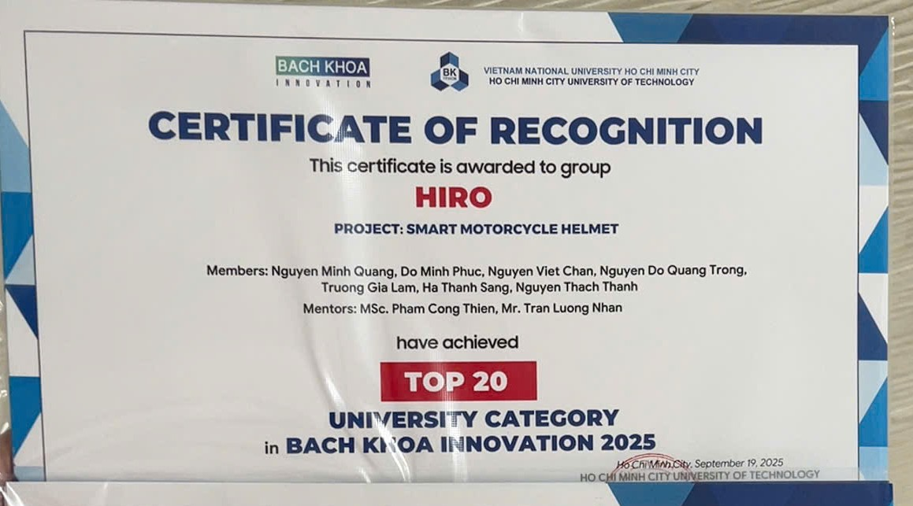
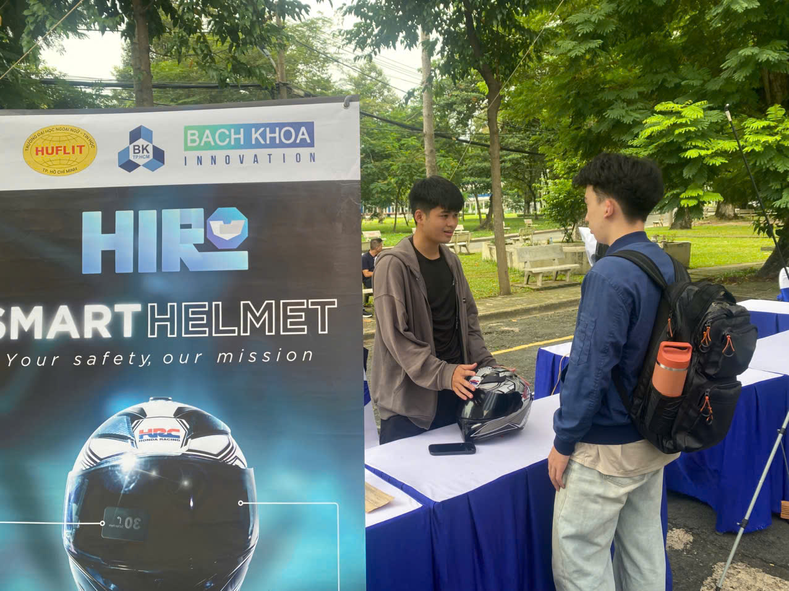
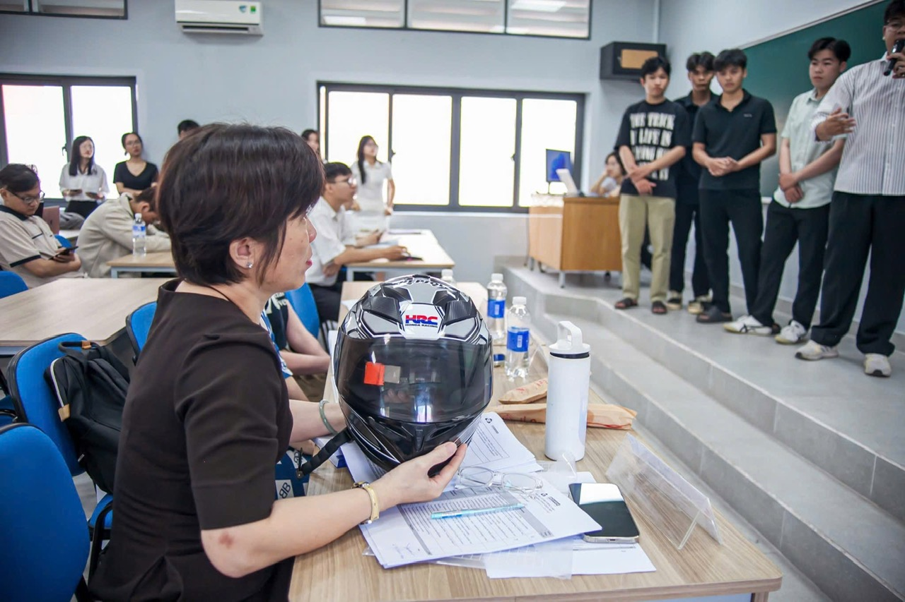

# Awards & Competition Evidence

Thư mục này dành để làm nổi bật minh chứng thành tích cuộc thi của dự án.

## Highlight

**ESP32-S3 Smart Helmet / HIRO Smart Motorcycle Helmet** được ghi nhận trong **Top 20 - University Category** tại **Bach Khoa Innovation 2025**. Đây là minh chứng quan trọng cho thấy dự án không chỉ dừng ở nguyên mẫu kỹ thuật, mà đã được trình bày, đánh giá và ghi nhận trong một sân chơi đổi mới sáng tạo.

## Thành Tích

| Hạng mục | Thông tin |
| --- | --- |
| Cuộc thi | Bach Khoa Innovation 2025 |
| Thành tích | Top 20 - University Category |
| Tên nhóm | HIRO |
| Tên dự án trên chứng nhận | Smart Motorcycle Helmet |
| Ngày ghi trên chứng nhận | September 19, 2025 |
| Đơn vị tổ chức hiển thị trên chứng nhận | Bach Khoa Innovation, Ho Chi Minh City University of Technology |

## Hình Ảnh Hoạt Động

### Booth Demo

Ảnh ghi lại hoạt động giới thiệu nguyên mẫu mũ bảo hiểm thông minh tại khu vực trưng bày, nơi nhóm trình bày ý tưởng, tính năng và thiết kế sản phẩm cho người quan tâm.

### Presentation & Evaluation

Ảnh ghi lại hoạt động trình bày/đánh giá sản phẩm trước hội đồng và người tham dự. Nguyên mẫu được sử dụng trực tiếp để minh họa giải pháp HUD, cảnh báo buồn ngủ và phát hiện tai nạn/SOS.

## Vai Trò Minh Chứng

Các hình ảnh trong thư mục này giúp repo thể hiện ba lớp bằng chứng:

- **Bằng chứng thành tích**: giấy chứng nhận Top 20.
- **Bằng chứng sản phẩm**: nguyên mẫu được trưng bày công khai.
- **Bằng chứng hoạt động**: nhóm đã trình bày và bảo vệ ý tưởng trước người đánh giá.
