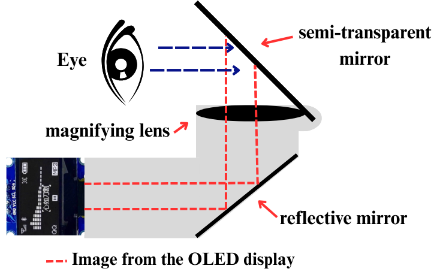

# System Architecture

## Tổng Quan Kiến Trúc

Hệ thống mũ bảo hiểm thông minh được thiết kế theo mô hình IoT ba lớp:

1. **Embedded Helmet System**: phần cứng gắn trên mũ, chịu trách nhiệm thu thập dữ liệu cảm biến, xử lý thời gian thực và hiển thị HUD.
2. **Mobile Application**: ứng dụng điện thoại dùng để dẫn đường, nhận cảnh báo, xác thực sự cố và gửi SOS.
3. **Connectivity & Emergency Layer**: GPS, Google Maps, SMS và BLE phục vụ liên lạc trong tình huống bình thường lẫn khẩn cấp.

## Luồng Dữ Liệu Chính

| Dữ liệu | Nguồn | Xử lý | Đầu ra |
| --- | --- | --- | --- |
| Gia tốc, con quay | MPU-6050 | ESP32-S3 lọc nhiễu, tính gia tốc tổng hợp và góc nghiêng | Trạng thái bình thường, nghi ngờ va chạm hoặc tai nạn |
| Hình ảnh mắt | MaixCam | Phân loại trạng thái mắt mở/nhắm | Cảnh báo buồn ngủ khi vượt ngưỡng |
| Lộ trình | Ứng dụng di động | Rút gọn chỉ dẫn từ Google Maps | Hiển thị turn-by-turn trên HUD |
| Vị trí | GPS/điện thoại | Tạo liên kết Google Maps | SMS SOS cho liên hệ khẩn cấp |
| Cảnh báo | ESP32-S3 và app | Xác thực theo kịch bản | Rung, âm thanh, HUD, thông báo, SMS |

## Phần Cứng Trên Mũ

### ESP32-S3

ESP32-S3 là bộ điều khiển trung tâm, phù hợp với thiết bị đeo nhờ khả năng xử lý tốt, hỗ trợ BLE và chạy được các tác vụ song song. Trong hệ thống này, ESP32-S3 quản lý:

- Đọc dữ liệu IMU.
- Nhận tín hiệu từ camera AI.
- Điều khiển OLED/HUD.
- Giao tiếp BLE với ứng dụng di động.
- Kích hoạt mô-tơ rung, âm thanh và logic cảnh báo.

### MPU-6050

MPU-6050 cung cấp dữ liệu gia tốc và con quay hồi chuyển 6 trục. Cảm biến được dùng cho hai bài toán:

- Phát hiện va chạm/ngã xe qua gia tốc đột biến và thay đổi góc nghiêng.
- Nhận diện hành vi gật đầu qua biến thiên góc pitch.

### MaixCam

MaixCam đảm nhận phần thị giác máy tính. Camera đặt gần vùng mắt để thu ảnh ROI ổn định, sau đó phân loại trạng thái mắt mở/nhắm. Cách xử lý tại biên giúp giảm tải cho ESP32-S3 và hạn chế độ trễ.

### HUD

HUD dùng màn hình OLED nhỏ kết hợp hệ quang học gồm gương phản xạ, thấu kính phóng đại và combiner bán trong suốt. Thông tin được đặt trong vùng nhìn ngoại biên, ưu tiên các ký hiệu dễ nhận biết như mũi tên rẽ, khoảng cách và cảnh báo.

### Nguồn

Nguyên mẫu sử dụng pin Lithium dung lượng khoảng 3000mAh. Pin và mạch sạc được đặt phía sau gáy để cân bằng với cụm HUD/camera phía trước, giảm cảm giác nặng đầu khi đội lâu.

## Bố Trí Cơ Khí

- ESP32-S3 và MPU-6050 đặt gần đỉnh mũ để đo chuyển động đầu chính xác.
- Camera đặt trong mũ, hướng về mắt người lái nhưng không cản tầm nhìn.
- HUD đặt lệch nhẹ sang phải, thấp hơn đường nhìn trung tâm.
- Pin đặt phía sau gáy để tạo đối trọng.
- Dây dẫn đi ngầm trong lớp lót nhằm tăng tính gọn gàng và an toàn.

## Phần Mềm Nhúng

Phần mềm được tổ chức theo các module độc lập:

| Module | Nhiệm vụ |
| --- | --- |
| Sensor Manager | Đọc dữ liệu MPU-6050, lọc nhiễu và chuẩn hóa tín hiệu. |
| Accident Detector | Phân tích gia tốc, góc nghiêng và trạng thái sau va chạm. |
| Drowsiness Monitor | Nhận kết quả mắt mở/nhắm, kết hợp dữ liệu gật đầu. |
| HUD Controller | Cập nhật biểu tượng dẫn đường, tốc độ và cảnh báo. |
| BLE Communication | Truyền/nhận dữ liệu giữa mũ và ứng dụng. |
| Alert Manager | Điều phối rung, âm thanh, HUD, app và SMS/SOS. |

## Nguyên Tắc Thiết Kế

- **Thời gian thực**: phát hiện nguy cơ và phản hồi trong vài giây.
- **Đa tầng xác thực**: kết hợp nhiều điều kiện để giảm báo động giả.
- **Tối giản giao diện**: chỉ hiển thị thông tin quan trọng nhất trên HUD.
- **Tối ưu năng lượng**: dùng BLE, xử lý tại biên và sleep mode khi phù hợp.
- **Công thái học**: cân bằng trọng lượng, không che tầm nhìn, không gây vướng.

## Những Rủi Ro Kỹ Thuật

- Camera có thể giảm độ chính xác khi thiếu sáng hoặc ngược sáng mạnh.
- Va chạm giả có thể xảy ra khi mũ rơi nhưng không có người đội.
- SOS phụ thuộc vào điện thoại nếu chưa tích hợp 4G/LTE độc lập.
- HUD cần tiếp tục tinh chỉnh độ sáng và góc nhìn trong nhiều điều kiện môi trường.

## Hướng Nâng Cấp Kiến Trúc

- Thêm cảm biến nhận diện người đội mũ.
- Thiết kế PCB tích hợp thay cho module rời.
- Bổ sung module 4G/LTE độc lập cho SOS.
- Nâng cấp HUD lên waveguide hoặc AR.
- Tích hợp thuật toán tự học để cá nhân hóa ngưỡng cảnh báo buồn ngủ.
