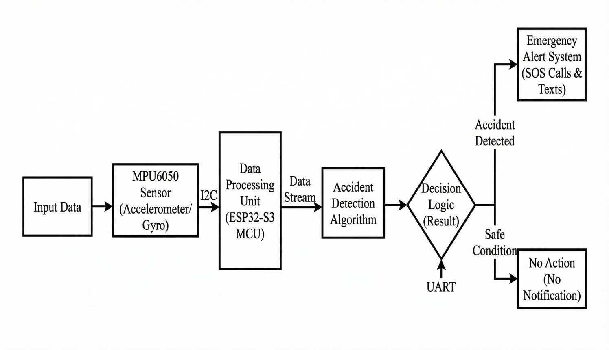
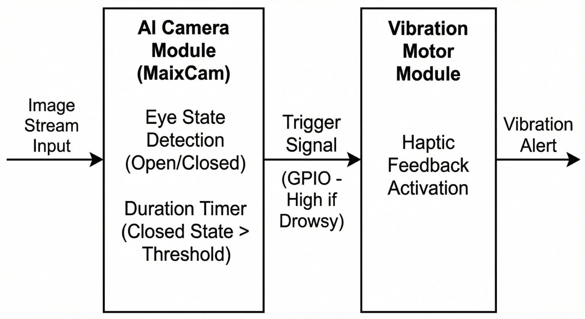

# Implementation & Testing

## Quy Trình Vận Hành

Khi người dùng bật thiết bị, mũ khởi động các module cảm biến và kết nối BLE với ứng dụng di động. Ở chế độ bình thường, hệ thống chạy song song ba luồng:

1. Theo dõi gia tốc/góc nghiêng để phát hiện va chạm.
2. Theo dõi trạng thái mắt và chuyển động đầu để cảnh báo buồn ngủ.
3. Nhận dữ liệu dẫn đường từ điện thoại và hiển thị lên HUD.

Khi phát hiện bất thường, `Alert Manager` chuyển hệ thống sang chế độ cảnh báo phù hợp: cảnh báo buồn ngủ, nghi ngờ tai nạn hoặc SOS khẩn cấp.

## Thuật Toán Phát Hiện Va Chạm

Hệ thống sử dụng MPU-6050 để đo gia tốc ba trục `ax`, `ay`, `az` và vận tốc góc. Gia tốc tổng hợp được tính theo công thức:

```text
Atotal = sqrt(ax^2 + ay^2 + az^2)
```

Quy trình phát hiện gồm ba tầng:

| Tầng | Điều kiện | Mục đích |
| --- | --- | --- |
| Giám sát ngưỡng | `Atotal` vượt ngưỡng nguy hiểm | Phát hiện cú sốc ban đầu. |
| Phân tích tư thế | Góc nghiêng thay đổi bất thường | Phân biệt ngã xe với rung lắc đường xấu. |
| Xác thực sau va chạm | Không có dấu hiệu hồi phục trong cửa sổ thời gian | Giảm báo động giả trước khi gửi SOS. |



## Quy Trình SOS

Khi hệ thống xác nhận nghi ngờ tai nạn, quy trình SOS hoạt động như sau:

1. Mũ phát cảnh báo âm thanh/rung và gửi tín hiệu đến ứng dụng.
2. Ứng dụng hiển thị đếm ngược xác thực trong 10-20 giây.
3. Người dùng có thể hủy nếu vẫn an toàn.
4. Nếu không có phản hồi, ứng dụng gửi SMS chứa vị trí Google Maps.
5. Nếu người dùng hủy muộn, hệ thống có thể gửi tin nhắn xác nhận an toàn.


## Thuật Toán Cảnh Báo Buồn Ngủ

### Phân Loại Trạng Thái Mắt

Camera MaixCam thu ảnh vùng mắt với tốc độ khoảng 30 fps. Quy trình xử lý:

1. Cắt vùng quan tâm chứa mắt.
2. Chuyển ảnh sang thang xám và tiền xử lý.
3. Phân loại trạng thái mắt thành `Open` hoặc `Closed`.
4. Theo dõi chuỗi thời gian để phân biệt chớp mắt tự nhiên với nhắm mắt kéo dài.

Nếu mắt đóng liên tục trên ngưỡng, ví dụ khoảng 2 giây, hệ thống coi đây là dấu hiệu microsleep và kích hoạt cảnh báo.

### Nhận Diện Gật Đầu

MPU-6050 theo dõi góc pitch của đầu. Hành vi gật đầu do buồn ngủ thường có biên độ lớn, tần suất thấp và khác với rung động mặt đường. Khi tín hiệu này xuất hiện cùng trạng thái mắt bất thường, độ tin cậy cảnh báo tăng lên.

### Cảnh Báo Đa Phương Thức



Khi phát hiện buồn ngủ, hệ thống dùng nhiều kênh cảnh báo:

- Mô-tơ rung trong mũ.
- Âm thanh cảnh báo.
- Biểu tượng cảnh báo trên HUD.
- Thông báo trên ứng dụng di động.
- Gợi ý điểm dừng nghỉ gần nhất trong phiên bản mở rộng.

## HUD Và Giao Diện Dẫn Đường

HUD chỉ hiển thị thông tin có giá trị tức thời:

- Hướng rẽ tiếp theo.
- Khoảng cách đến điểm rẽ.
- Tốc độ hiện tại.
- Cảnh báo an toàn khi cần.

Triết lý giao diện là tối giản, tương phản cao và không chiếm vùng nhìn trung tâm. Nhờ đó người lái có thể tiếp nhận thông tin nhanh mà vẫn tập trung vào đường.

## Kịch Bản Thử Nghiệm

| Giai đoạn | Nội dung |
| --- | --- |
| Lab test | Kiểm thử từng module: IMU, camera, HUD, BLE, cảnh báo. |
| Simulator | Mô phỏng rung lắc, ngã xe và hành vi buồn ngủ. |
| Field test | Chạy thử quãng đường ngắn 5-10 km để đánh giá kết nối và công thái học. |
| UX survey | Khảo sát 10 tình nguyện viên về trọng lượng, cảm giác đội và tính hữu ích. |

## Kết Quả Chính

| Tiêu chí | Kết quả |
| --- | --- |
| Phát hiện va chạm nghiêm trọng | 100% trong 10 lần mô phỏng. |
| Gia tốc đỉnh ghi nhận | Xấp xỉ 4g trong kịch bản thả rơi mô phỏng. |
| Thời gian gửi SOS | Khoảng 15 giây, gồm cả thời gian chờ xác thực. |
| Phát hiện nhắm mắt trên 3 giây | 5/5 lần. |
| Độ trễ cảnh báo buồn ngủ | Khoảng 2.5-3 giây. |
| Báo động giả buồn ngủ | 1 trường hợp trong thử nghiệm khi người lái nhìn xuống lâu. |
| Trọng lượng tăng thêm | Khoảng 250g so với mũ tiêu chuẩn. |
| Thời lượng pin | Khoảng 7-9 giờ trong điều kiện thử nghiệm. |

## Hạn Chế

- Chưa có cảm biến xác nhận mũ đang được đội, nên mũ rơi có thể gây báo động giả.
- Camera còn nhạy với thiếu sáng, ngược sáng và góc nhìn bị che.
- Thuật toán dùng ngưỡng chung, chưa cá nhân hóa theo thói quen từng người.
- SOS vẫn phụ thuộc vào điện thoại nếu chưa có module 4G/LTE độc lập.
- Cụm HUD cần tối ưu thêm để đạt chất lượng hiển thị ổn định ngoài trời.

## Kết Luận Kỹ Thuật

Nguyên mẫu đã chứng minh tính khả thi của việc tích hợp ba chức năng an toàn trên một mũ bảo hiểm thông minh dùng ESP32-S3. Các kết quả thử nghiệm cho thấy hệ thống phản hồi nhanh, có cơ chế xác thực hợp lý và đủ ổn định cho giai đoạn nghiên cứu tiếp theo. Những hạn chế hiện tại chủ yếu thuộc về tinh chỉnh công nghiệp, điều kiện môi trường và độ hoàn thiện sản phẩm, không làm mất đi giá trị cốt lõi của kiến trúc đề xuất.
