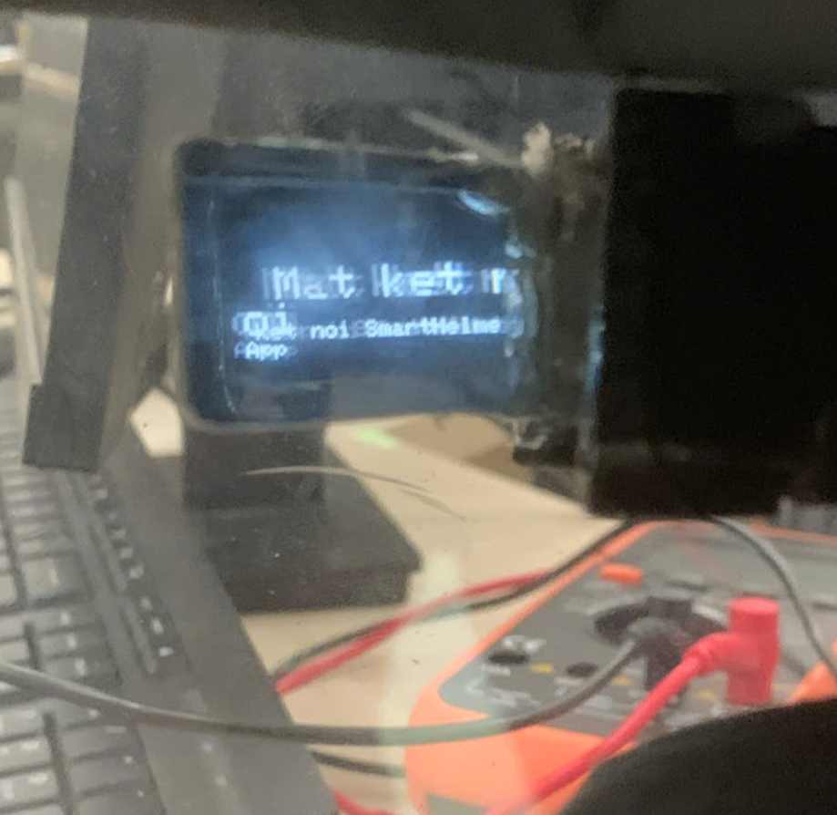
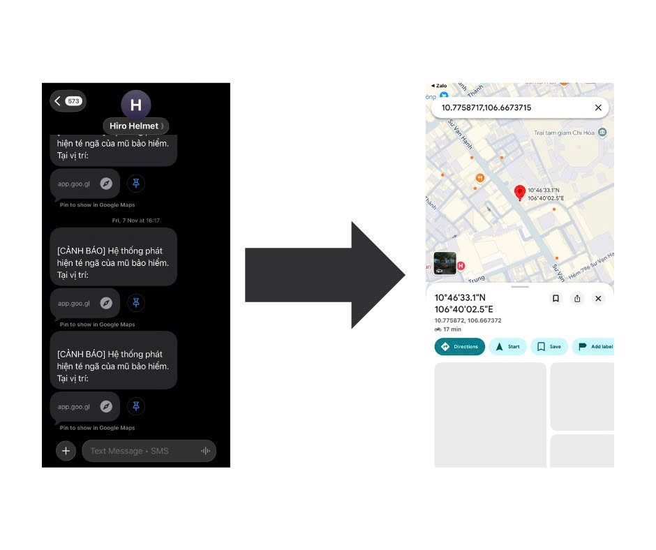

# Project Overview

## Tên Dự Án

**Mũ bảo hiểm thông minh** - nguyên mẫu thiết bị an toàn chủ động cho người điều khiển mô tô, xe máy.

## Bối Cảnh

Người đi mô tô, xe máy là nhóm dễ bị tổn thương trong giao thông vì thiếu lớp bảo vệ vật lý như ô tô. Khi tai nạn xảy ra, thời gian phát hiện và gọi cứu hộ càng ngắn thì khả năng can thiệp trong "thời gian vàng" càng cao. Bên cạnh va chạm, các yếu tố như buồn ngủ, mất tập trung và cúi nhìn điện thoại để xem bản đồ cũng làm tăng rủi ro tai nạn.

Từ nhu cầu đó, đề tài phát triển một mũ bảo hiểm thông minh có khả năng hỗ trợ người lái trước, trong và sau tình huống nguy hiểm: hiển thị thông tin ngay trong tầm nhìn, cảnh báo buồn ngủ theo thời gian thực và tự động gửi SOS khi phát hiện tai nạn.

## Mục Tiêu

- Thiết kế nguyên mẫu mũ bảo hiểm thông minh phù hợp với điều kiện sử dụng tại Việt Nam.
- Tích hợp ba chức năng trọng tâm: HUD dẫn đường, cảnh báo buồn ngủ và phát hiện tai nạn/SOS.
- Tối ưu hệ thống theo hướng gọn nhẹ, tiêu thụ năng lượng thấp, chi phí hợp lý và dễ mở rộng.
- Đánh giá khả năng hoạt động của hệ thống qua mô phỏng, thử nghiệm module và thử nghiệm thực địa quy mô nhỏ.

## Minh Chứng Nổi Bật

| Minh chứng | Vị trí |
| --- | --- |
| Paper accepted | `paper/ACCEPTED_PAPER_SPRINGER_V2.docx` |
| Top cuộc thi | `awards/README.md` và các file chứng nhận/hình ảnh bổ sung trong `awards/` |
| Báo cáo nghiên cứu | `reports/RESEARCH_REPORT_SMART_HELMET.docx` |

Các minh chứng này giúp repo thể hiện rõ dự án có nền tảng nghiên cứu, có sản phẩm nguyên mẫu và có kết quả được công nhận qua hoạt động học thuật/cuộc thi.

## Phạm Vi Nghiên Cứu

Đề tài tập trung ở mức nguyên mẫu nghiên cứu, chưa hướng tới thương mại hóa ngay. Phạm vi bao gồm:

- Thiết kế phần cứng lắp trên mũ.
- Phát triển phần mềm nhúng trên ESP32-S3.
- Xây dựng logic giao tiếp với ứng dụng di động qua BLE.
- Thiết kế cơ chế gửi cảnh báo SOS kèm vị trí GPS.
- Kiểm thử các kịch bản va chạm, buồn ngủ, dẫn đường và trải nghiệm đội mũ.

## Chức Năng Cốt Lõi

### 1. HUD Dẫn Đường

HUD hiển thị chỉ dẫn rẽ, khoảng cách và thông tin tốc độ trong vùng quan sát ngoại biên của người lái. Thiết kế giao diện ưu tiên tối giản để người dùng đọc nhanh mà không bị che khuất tầm nhìn.

### 2. Giám Sát Buồn Ngủ

Camera MaixCam theo dõi vùng mắt và phân loại trạng thái mở/nhắm. Khi mắt nhắm liên tục vượt ngưỡng hoặc xuất hiện dấu hiệu gật đầu từ dữ liệu MPU-6050, hệ thống kích hoạt cảnh báo rung, âm thanh, HUD và thông báo điện thoại.

### 3. Phát Hiện Tai Nạn Và SOS

MPU-6050 theo dõi gia tốc tổng hợp và góc nghiêng của mũ. Khi phát hiện biến động bất thường, hệ thống chuyển sang trạng thái nghi ngờ tai nạn, mở cửa sổ xác thực 10-20 giây. Nếu người dùng không phản hồi, ứng dụng gửi SMS chứa vị trí Google Maps cho liên hệ khẩn cấp.

## Đối Tượng Sử Dụng

- Người đi xe máy, mô tô trong đô thị và ngoại thành.
- Người thường xuyên di chuyển đường dài, dễ gặp rủi ro mệt mỏi hoặc mất tập trung.
- Nhóm nghiên cứu, sinh viên và kỹ sư quan tâm đến IoT, embedded system, an toàn giao thông và thiết bị đeo thông minh.

## Nhóm Thực Hiện

| Vai trò | Họ tên |
| --- | --- |
| Chủ nhiệm | Hà Thanh Sang |
| Thành viên | Nguyễn Việt Chân |
| Thành viên | Đỗ Minh Phúc |
| Thành viên | Nguyễn Thạch Thành |
| Thành viên | Nguyễn Minh Quang |
| Giảng viên hướng dẫn | TS. Phạm Công Thiện |

## Cấu Trúc Báo Cáo Gốc

Nội dung báo cáo gốc được tổ chức theo sáu chương:

1. Tổng quan nghiên cứu.
2. Thiết kế hệ thống.
3. Phát hiện va chạm và gửi cảnh báo SOS.
4. Giám sát tình trạng người lái và cảnh báo buồn ngủ.
5. Hiển thị thông tin qua Head-Up Display.
6. Thử nghiệm và đánh giá hệ thống.

## Giá Trị Của Dự Án

Dự án thể hiện một hướng tiếp cận tích hợp: thay vì chỉ thêm một cảm biến cảnh báo đơn lẻ, hệ thống phối hợp dữ liệu từ chuyển động, hình ảnh, định vị và giao diện hiển thị để tạo thành một nền tảng an toàn hoàn chỉnh. Đây là cơ sở tốt để tiếp tục phát triển thành sản phẩm có tính ứng dụng cao hơn trong hệ sinh thái giao thông thông minh.
